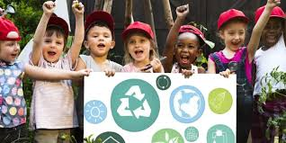
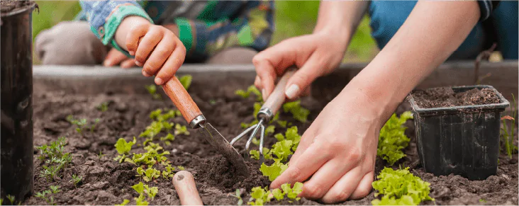
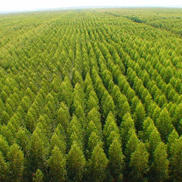

# Verde Ação 🌱

**Verde Ação** é um projeto do curso de fullstack da escola Vai na Web.  

---

## 🌟 Funcionalidades Implementadas

- **Header com mensagem de boas-vindas** e botão de chamada para ação  
  

- **Seção de cards** apresentando atividades:
  - Plantio de mudas 
  - Educação ambiental 
  - Cuidados com áreas preservadas 
  - Mapeamento de áreas 

- **Formulário de cadastro de voluntários**:
  - Campos: Nome, E-mail, Cidade, Atividade
  - Validação básica nos inputs  
  

- **Footer simples** com direitos reservados

- **Estilização responsiva** usando CSS moderno, cores, sombras e botões interativos

---

## 🎨 Tecnologias Utilizadas

- **HTML5** – Estrutura do site
- **CSS3 / SCSS** – Estilização e layout responsivo
- **Google Fonts** – Inter e Roboto para tipografia
- Layout flexível com **cards**, **botões chamativos** e **formulário centralizado**

---

## 💻 Como Executar

1. Clone o repositório:
```bash
git clone https://github.com/SEU-USUARIO/projeto-verde-acao.git
